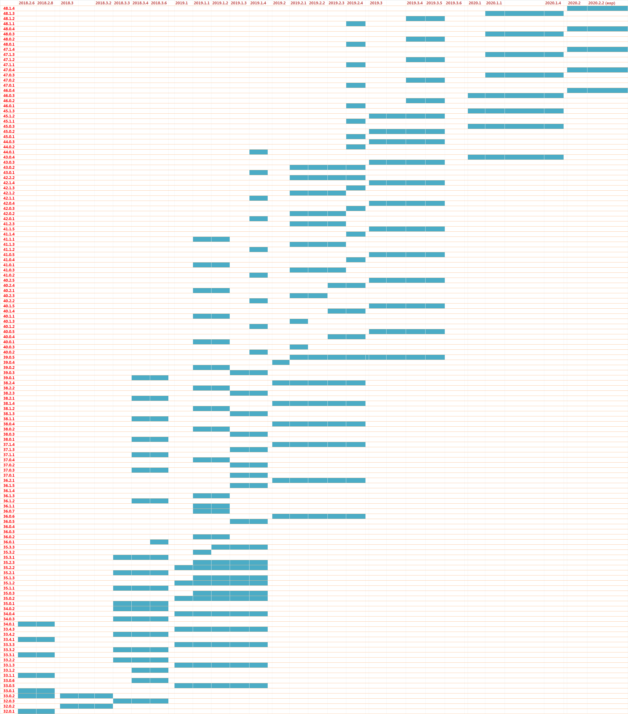

[TOC]

**其实这个没必要特别记忆，只要打开IDEA或者AS的插件市场，搜索一下Flutter或Dart插件，会自动提供最适合的插件版本供你下载。**

## Flutter，Dart插件和Android Studio版本对照表：

Flutter插件版本|Dart插件版本|Android Studio版本
----|----|----
42.1.4|193.5731|193.6107147.5233（4.0canary8）
48.1.1|192.8052|192.6200805.7142（3.6.0）
44.0.1|191.8593|191.6010548.8026（3.5.3）
39.0.1|183.6270|183.5692245.6156（3.4.2）
未完待续||
||
||
||
||
||

----

## Flutter，Dart插件和IntelliJ IDEA版本对照表：

Flutter插件版本|Dart插件版本|IDEA Ultimate Edition版本
----|----|----
43.0.2|192.8052|IDEA 2019.2.3
未完待续||
||
||
||
||
||

由于IDEA的版本太多，这里就不逐个复制粘贴了，具体请看下图：

